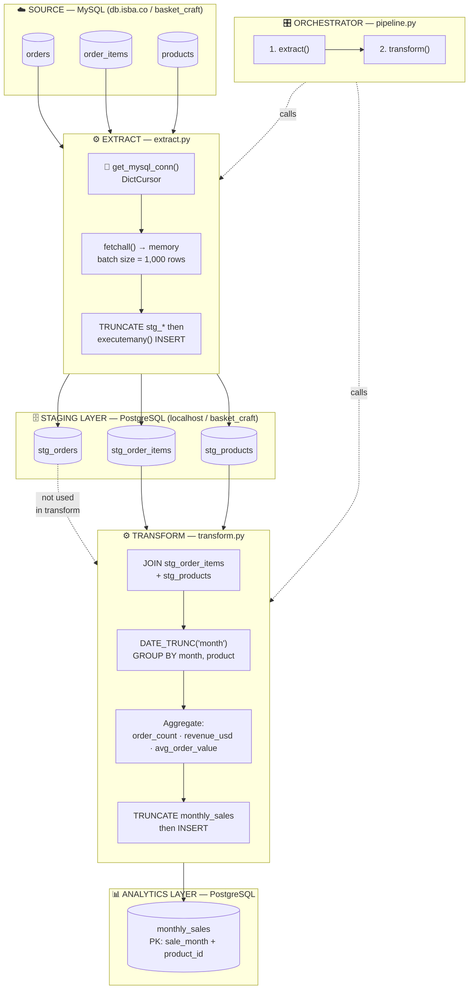

# BasketCraft ELT Pipeline Diagram

## Data Flow Summary

| Step | Phase | From | To | Key Mechanic |
|------|-------|------|----|--------------|
| 1 | Extract | MySQL `orders` | `stg_orders` | TRUNCATE + batch INSERT |
| 2 | Extract | MySQL `order_items` | `stg_order_items` | TRUNCATE + batch INSERT |
| 3 | Extract | MySQL `products` | `stg_products` | TRUNCATE + batch INSERT |
| 4 | Transform | `stg_order_items` + `stg_products` | `monthly_sales` | DATE_TRUNC GROUP BY aggregation |

## monthly_sales Schema (Output)

| Column | Type | Description |
|--------|------|-------------|
| `sale_month` | DATE (PK) | First day of each month |
| `product_id` | INT (PK) | Product identifier |
| `product_name` | VARCHAR(50) | Denormalized for query convenience |
| `order_count` | INT | Distinct orders per product-month |
| `revenue_usd` | NUMERIC(12,2) | Sum of `price_usd` from order_items |
| `avg_order_value` | NUMERIC(10,2) | `revenue_usd / order_count` |

## Design Properties

- **Idempotent** — both phases TRUNCATE before insert; safe to re-run
- **Atomic** — each phase rolls back on error; no partial state
- **Injection-safe** — table names whitelisted; values parameterized
